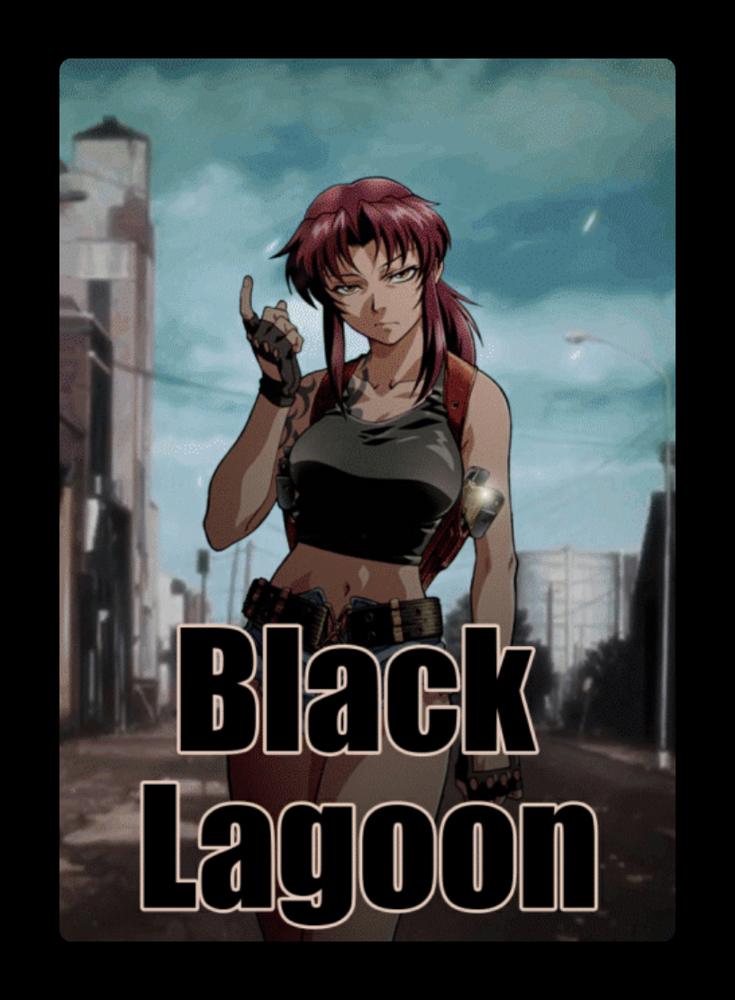
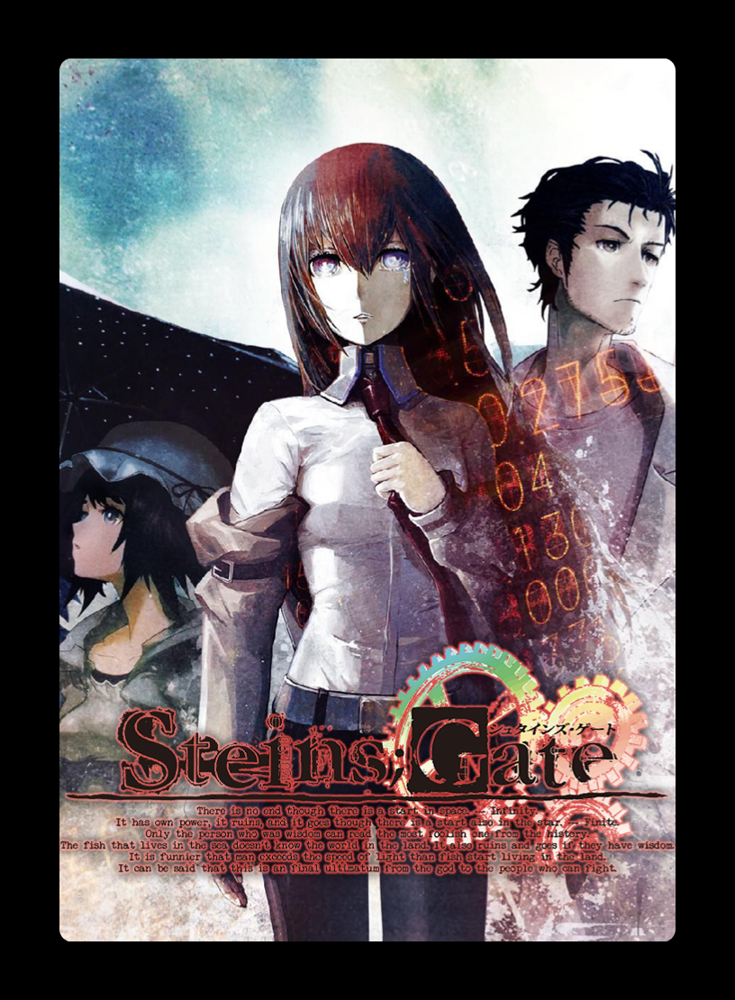
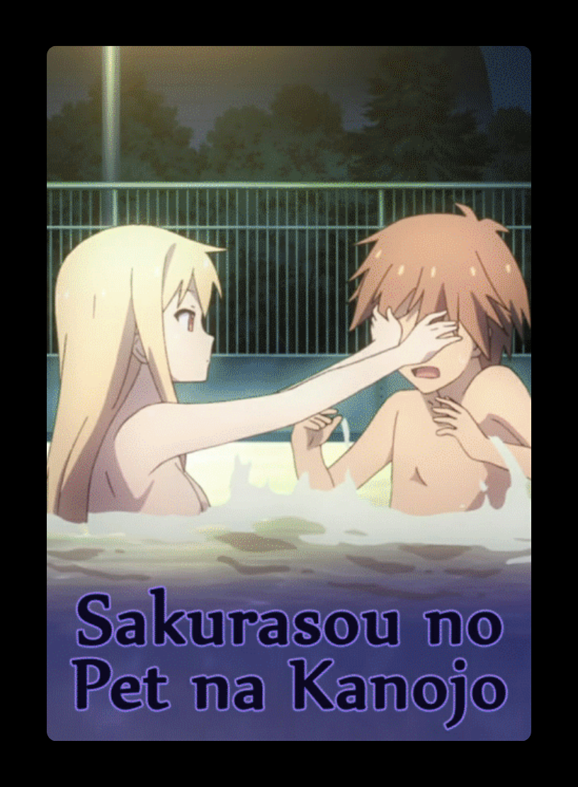
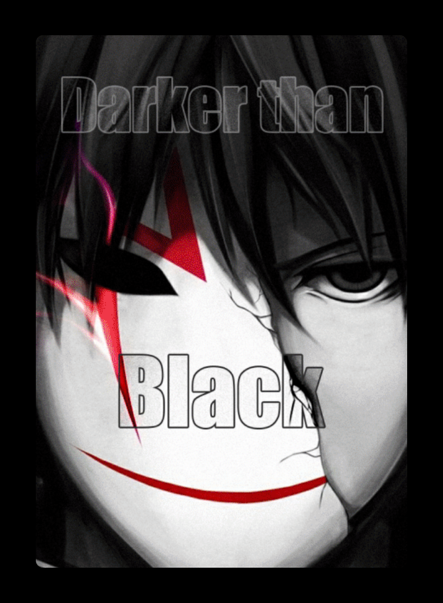
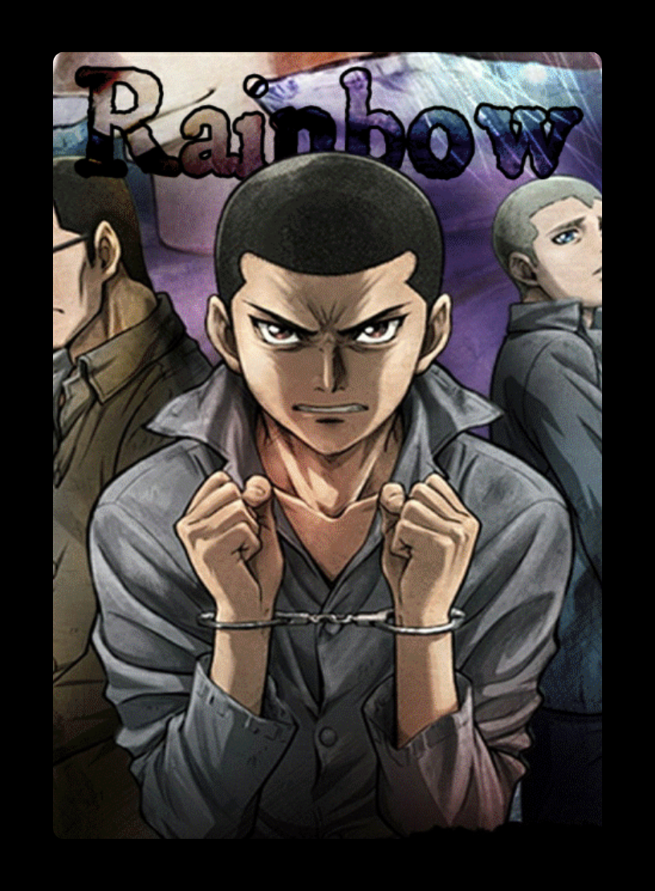
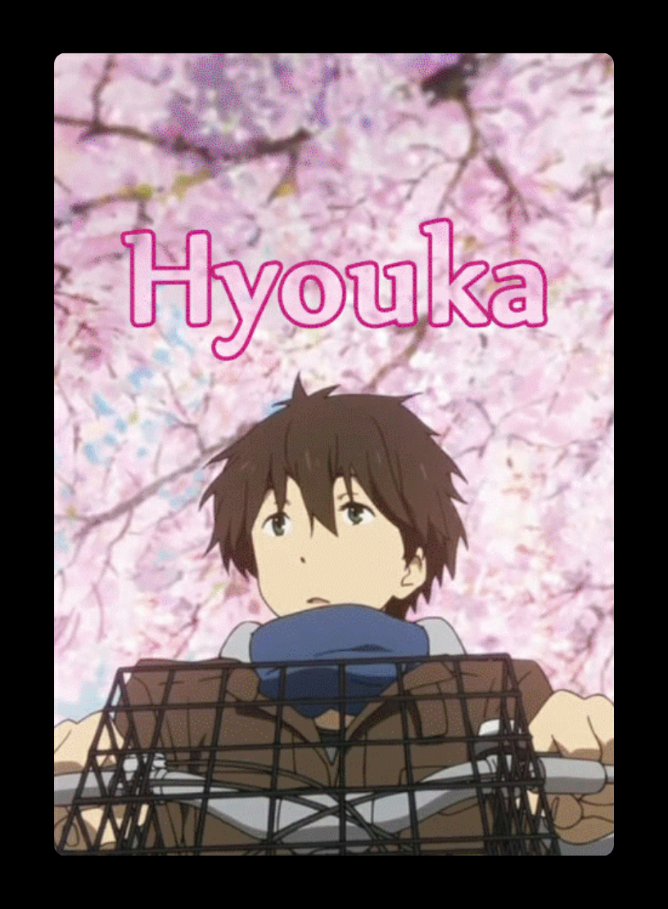

# Deck Vieux Dragon
**Auteur :** Un vieux  
**Categorie :** KARUTA  
**Type :** NORMAL  

Un des deux premiers deck de Karuta !  

**Couverture :**  
  

## Liste des cartes :
### [01 - My Soul,Your Beats!](https://naedist.animemusicquiz.com/ocbvdf.mp3)
&emsp;**Anime :** [Angel Beats!](https://anilist.co/anime/6547) - OP1  
&emsp;**Artiste(s) :** Lia  

  

### [02 - Seishun Satsubatsuron](https://naedist.animemusicquiz.com/w3soom.mp3)
&emsp;**Anime :** [Assassination Classroom](https://anilist.co/anime/20755) - OP1  
&emsp;**Artiste(s) :** 3-nen E-gumi Utatan  

  

### [03 - Perfect-area complete!](https://naedist.animemusicquiz.com/f6tvog.mp3)
&emsp;**Anime :** [Baka and Test - Summon the Beasts](https://anilist.co/anime/6347) - OP1  
&emsp;**Artiste(s) :** Natsuko Aso  

  

### [04 - Hey World](https://naedist.animemusicquiz.com/om3nxv.mp3)
&emsp;**Anime :** [Danmachi](https://anilist.co/anime/20920) - OP1  
&emsp;**Artiste(s) :** Yuka Iguchi  

  

### [05 - Red fraction](https://naedist.animemusicquiz.com/ea4aht.mp3)
&emsp;**Anime :** [BLACK LAGOON](https://anilist.co/anime/889) - OP1  
&emsp;**Artiste(s) :** MELL  

  

### [06 - YOUTHFUL](https://naedist.animemusicquiz.com/rt3mrf.mp3)
&emsp;**Anime :** [Chihayafuru](https://anilist.co/anime/10800) - OP1  
&emsp;**Artiste(s) :** 99RadioService  

  

### [07 - Can Do](https://naedist.animemusicquiz.com/e18ebk.mp3)
&emsp;**Anime :** [Kuroko's Basketball](https://anilist.co/anime/11771) - OP1  
&emsp;**Artiste(s) :** GRANRODEO  

  

### [08 - Kibou no Uta](https://naedist.animemusicquiz.com/dtbgrd.mp3)
&emsp;**Anime :** [Food Wars!](https://anilist.co/anime/20923) - OP1  
&emsp;**Artiste(s) :** Ultra Tower  

  

### [09 - Yakusoku wa Iranai](https://naedist.animemusicquiz.com/alpp3r.mp3)
&emsp;**Anime :** [Escaflowne](https://anilist.co/anime/393) - OP1  
&emsp;**Artiste(s) :** Maaya Sakamoto  

  

### [10 - ZERO!!](https://naedist.animemusicquiz.com/pz1eik.mp3)
&emsp;**Anime :** [The Devil is a Part-Timer!](https://anilist.co/anime/15809) - OP1  
&emsp;**Artiste(s) :** Minami Kuribayashi  

  

### [11 - Hacking to the Gate](https://naedist.animemusicquiz.com/8yqtn1.mp3)
&emsp;**Anime :** [Steins;Gate](https://anilist.co/anime/9253) - OP1  
&emsp;**Artiste(s) :** Kanako Itou  

  

### [12 - Genesis](https://naedist.animemusicquiz.com/gl8vdc.mp3)
&emsp;**Anime :** [Dimension W](https://anilist.co/anime/21256) - OP1  
&emsp;**Artiste(s) :** STEREO DIVE FOUNDATION  

  

### [13 - Goya no Machiawase](https://naedist.animemusicquiz.com/4xappz.mp3)
&emsp;**Anime :** [Noragami](https://anilist.co/anime/20447) - OP1  
&emsp;**Artiste(s) :** Hello Sleepwalkers  

  

### [14 - Kuusou Mesorogiwi](https://naedist.animemusicquiz.com/wz2pxh.mp3)
&emsp;**Anime :** [The Future Diary](https://anilist.co/anime/10620) - OP1  
&emsp;**Artiste(s) :** Yousei Teikoku  

  

### [15 - Parallel Hearts](https://naedist.animemusicquiz.com/mej27w.mp3)
&emsp;**Anime :** [Pandora Hearts](https://anilist.co/anime/5530) - OP1  
&emsp;**Artiste(s) :** FictionJunction  

  

### [16 - Renegade](https://naedist.animemusicquiz.com/knqpsx.mp3)
&emsp;**Anime :** [GANGSTA.](https://anilist.co/anime/20773) - OP1  
&emsp;**Artiste(s) :** STEREO DIVE FOUNDATION  

  

### [17 - Flyers](https://naedist.animemusicquiz.com/3rr4oz.mp3)
&emsp;**Anime :** [Death Parade](https://anilist.co/anime/20931) - OP1  
&emsp;**Artiste(s) :** BRADIO  

  

### [18 - Kimi ga Yume o Tsuretekita](https://naedist.animemusicquiz.com/z80wtl.mp3)
&emsp;**Anime :** [The Pet Girl of Sakurasou](https://anilist.co/anime/13759) - OP1  
&emsp;**Artiste(s) :** Pet na Kanojo-tachi  

  

### [19 - HOWLING](https://naedist.animemusicquiz.com/dudcm3.mp3)
&emsp;**Anime :** [Darker than Black](https://anilist.co/anime/2025) - OP1  
&emsp;**Artiste(s) :** abingdon boys school  

  

### [20 - kiri](https://naedist.animemusicquiz.com/tg3wsc.mp3)
&emsp;**Anime :** [Ergo Proxy](https://anilist.co/anime/790) - OP1  
&emsp;**Artiste(s) :** MONORAL  

  

### [21 - We're not alone](https://naedist.animemusicquiz.com/e6mx5t.mp3)
&emsp;**Anime :** [Rainbow](https://anilist.co/anime/6114) - OP1  
&emsp;**Artiste(s) :** coldrain  

  

### [22 - Yasashisa no Riyuu](https://naedist.animemusicquiz.com/yscax2.mp3)
&emsp;**Anime :** [Hyouka](https://anilist.co/anime/12189) - OP1  
&emsp;**Artiste(s) :** ChouCho  

  

### [23 - Spirit Inspiration](https://naedist.animemusicquiz.com/7gp53r.mp3)
&emsp;**Anime :** [Blast of Tempest](https://anilist.co/anime/14075) - OP1  
&emsp;**Artiste(s) :** Nothing's Carved In Stone  

  

### [24 - Kuchizuke](https://naedist.animemusicquiz.com/nilp4x.mp3)
&emsp;**Anime :** [Shiki](https://anilist.co/anime/7724) - OP1  
&emsp;**Artiste(s) :** BUCK-TICK  

  

### [25 - Sakura Kiss](https://naedist.animemusicquiz.com/620dkp.mp3)
&emsp;**Anime :** [Ouran High School Host Club](https://anilist.co/anime/853) - OP1  
&emsp;**Artiste(s) :** Chieko Kawabe  

  

### [26 - Bouken Desho Desho?](https://naedist.animemusicquiz.com/pp1tnm.mp3)
&emsp;**Anime :** [The Disappearance of Haruhi Suzumiya](https://anilist.co/anime/7311) - OP1  
&emsp;**Artiste(s) :** Aya Hirano  

  

### [27 - KINGS](https://naedist.animemusicquiz.com/wtth3t.mp3)
&emsp;**Anime :** [K](https://anilist.co/anime/14467) - OP1  
&emsp;**Artiste(s) :** angela  

  

### [28 - V.I.P](https://naedist.animemusicquiz.com/fjivh8.mp3)
&emsp;**Anime :** [Magi: The Labyrinth of Magic](https://anilist.co/anime/14513) - OP1  
&emsp;**Artiste(s) :** SID  

  

### [29 - Thème Pokémon](https://www.youtube.com/watch?v=CUy0fIK7f5A)
&emsp;**Anime :** [Pokémon](https://anilist.co/anime/527) - OP1  
&emsp;**Artiste(s) :** Jean-Marc Anthony Kabeya, Alexandre Gibert, Jacques Siatem   

  

### [30 - TELL ME WHY](https://naedist.animemusicquiz.com/byudbj.mp3)
&emsp;**Anime :** [Berserk](https://anilist.co/anime/33) - OP1  
&emsp;**Artiste(s) :** PENPALS  

  

